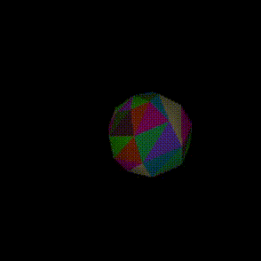

# Fraya

An OK software PBR ray-tracer.

Development start: 16th of April 2026

# Current state

Renders an ico-sphere.

# TODO

- [x] Trace a single triangle
    - [x] Surfaces for rendering on
    - [x] SDL window surface
    - [x] Render module with high level primitives
    - [x] Möller–Trumbore intersection POC
- [x] A camera that can move and look
- [x] Multi-triangle rendering
    - [x] The concept of a `Mesh`.
    - [x] Finding a way to 
    - [x] Rendering a `Mesh`.
    - [x] For now via iterating one by one.
- [ ] BVH(May move)
    - [x] Cleanup some the APIs particularly `Triangle`.
    - [ ] SAH-based AABB implemntation.
- [ ] Point light
